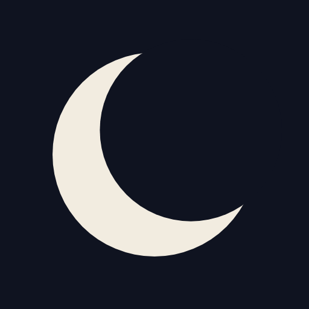

# Moon

The phase of the moon tonight, over a small city. An installable PWA meant for
a phone.



## Running it

The app uses ES modules and a service worker, so it **must be served over HTTP**
— opening `index.html` from the filesystem will not work (browsers block module
loading over `file://`).

```sh
python3 -m http.server 8000    # then open http://localhost:8000
```

To deploy, push to GitHub Pages, or copy the directory to any static host. All
paths are relative, so it works from a subdirectory as happily as from a root.

Installing: on iOS, Share → Add to Home Screen. On Android, Chrome offers
"Install app" once the service worker is active.

## Layout

```
index.html          markup only
manifest.json       PWA metadata
sw.js               precaches everything; the app works offline
css/moon.css        palette and layout
js/
  astro.js          Sun and Moon positions, and where they are in your sky.
                    Pure: milliseconds in, angles out
  phase.js          phase naming, age, next new/full moon
  moon-svg.js       the lit-limb path and the disc's SVG nodes
  city.js           silhouette vocabulary and the skyline composer
  scene.js          star field, skyline layers, window lights, meteors
  app.js            wiring: clock, render loop, hemisphere, offline
icons/
```


`astro.js` and `phase.js` have no DOM dependencies, so they can be imported and
tested on their own.

## About the numbers

Positions follow Meeus, *Astronomical Algorithms* (2nd ed): chapter 25 for the
Sun and the abridged ELP-2000/82 of chapter 47 for the Moon, with Espenak &
Meeus ΔT so the series are indexed by terrestrial time rather than the browser's
UTC clock.

The implementation reproduces Meeus's worked Example 47.a exactly: for 1992
April 12.0 TD it gives λ 133.162655°, β −3.229126°, Δ 368409.7 km, matching
every published digit. Against eclipse syzygies — an eclipse is an exact new or
full moon — from 2017 to 2026, new and full moon land inside a minute, which is
as fine as those reference times are quoted. Lunation lengths over 25 years span
29.277 to 29.824 days, matching the real extremes.

Nutation is applied to the Sun and the Moon alike. It is common to both, so it
cancels in the elongation the phases are defined on; applying it to only one
leaves up to 0.0048° there, worth about 34 seconds of syzygy timing.

Altitude and azimuth are geocentric. Lunar parallax reaches about a degree and
refraction lifts a low body by another half; both are ignored, because this
places a disc in a stylised drawing rather than predicting a rise time.

Two deliberate approximations:

- **Age** is measured from the previous new moon, found by root-finding
  backwards, rather than by dividing the phase angle by the synodic month.
- **Hemisphere** flips the disc 180°. The true bright-limb angle depends on the
  moon's altitude and azimuth; the flip is the usual stand-in. Geolocation is
  only ever used for the sign of your latitude, and the button overrides it.

## What the scene is doing

Most of it is driven by the same numbers, not decoration:

- The moon's **apparent size** follows its real distance — a 14% swing between
  perigee and apogee.
- **Earthshine** on the unlit face scales with how thin the crescent is.
- The moon **sits at its real altitude** (bounded, so the layout holds), sinks
  and dims below the horizon, and **rim-lights the rooftops** in proportion to
  its phase and height.
- The **sky blends toward twilight** by the sun's real altitude.
- Stars **twinkle harder near the horizon**, where you look through more air,
  and the field turns once per sidereal day.
- **Window lights** follow the hour of the day.

## Changing the scene

The skyline is generated in `js/city.js`: `SHAPES` is the silhouette
vocabulary, `compose()` places them from a seeded sequence under a height
envelope, and `windowGrid()` and `roofClutter()` add the detail. Sizes are in
hundredths of the band height, so proportions hold at any screen size.

`CITY_SEED` in `js/scene.js` fixes which city you get; change it for a
different one. `CURVE` in the same file sets how many windows are lit at each
hour of the day.

Bump `VERSION` in `sw.js` whenever you change an asset, or returning visitors
will keep the cached copy.
